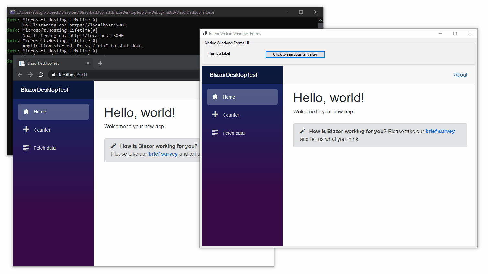

# Cross platform Blazor Desktop example

This hacked together sample shows a Blazor Desktop app running in both a web browser and in a WinForms wrapper with interop. This uses the default Blazor Server template app.



To run it open ```/BlazorDesktopTest/BlazorDesktopTest.sln``` in Visual Studio 16.9 with the .NET 6 Preview 2 SDK installed and "Enable Preview .NET SDKs" turned on. You can then F5 the BlazorDesktopTest and BlazorWinFormsApp projects. 

This code contains a load of stuff from the main aspnetcore repository, mainly because the ```Microsoft.AspNetCore.Components.WebView``` nuget package is not published yet (as of April 4th 2021).